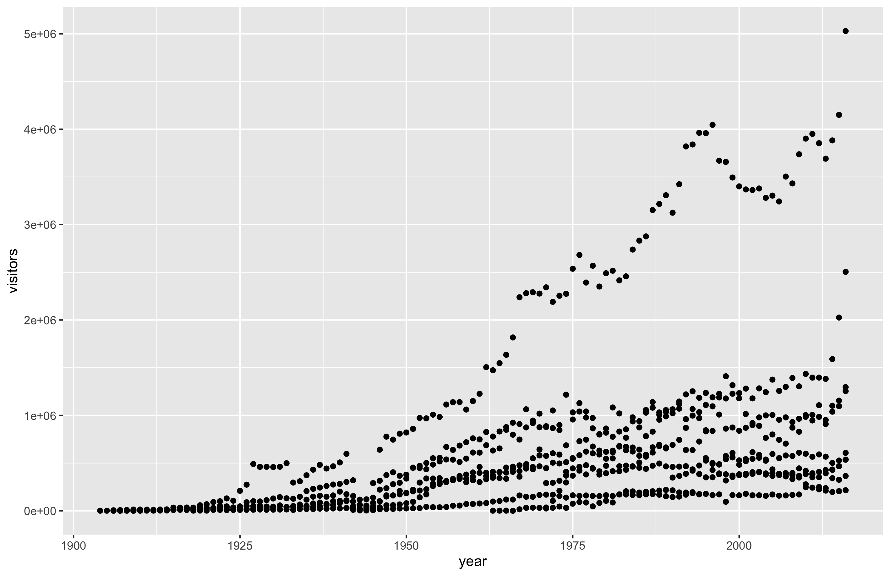

learn data visulization with ggplot2
```{r setup, message=FALSE} 
knitr::opts_chunk$set(echo=TRUE)
library(tidyverse)
library(MASS)
```
```{r, message = F}
#National Parks in California
ca <- read_csv("data/ca.csv") 

#Acadia National Park
acadia <- read_csv("data/acadia.csv")

#Southeast US National Parks
se <- read_csv("data/se.csv")

#2016 Visitation for all Pacific West National Parks
visit_16 <- read_csv("data/visit_16.csv")

#All Nationally designated sites in Massachusetts
mass <- read_csv("data/mass.csv")
```
```{r}
head(ca)
```
```{r, eval = F}
ggplot(data = ca) + 
  geom_point(aes(x = year, y = visitors))
```
```{r, echo = F, out.height='420px'}

```